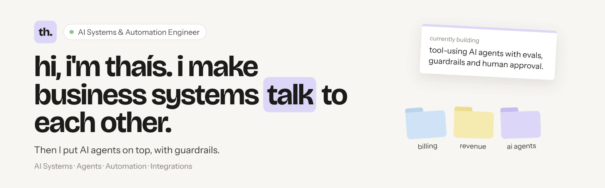
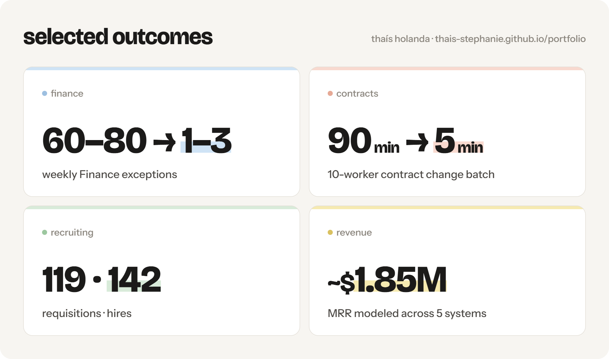

  

  <a href="https://thais-stephanie.github.io/portfolio/"><strong>Portfolio</strong></a>
  ·
  <a href="https://www.linkedin.com/in/thaisstephanie/">LinkedIn</a>
  ·
  <a href="mailto:contato@thaisholanda.com">Email</a>

I build **AI agents, automations and integrations on top of real business systems**.

My background spans 8+ years across CRM, billing, Revenue Operations, Finance, recruiting and internal systems — owning solutions from discovery and architecture through production, monitoring and adoption.

Today I’m focused on **tool-using AI agents and reliable LLM systems**: deterministic business logic where it belongs, constrained tools, structured outputs, evaluations, release gates, guardrails and human approval for high-impact actions.

📍 Fortaleza, Brazil · UTC−3 · Remote worldwide

 

 

## What I'm building now

### [DTC Revenue Operations Agent](https://thais-stephanie.github.io/portfolio/case-dtc-revenue-agent.html)

A **tool-using AI agent built with Claude** for a synthetic portfolio of ecommerce brands.

The system deliberately separates deterministic business logic from model reasoning:

- **Python and SQL** detect account signals, calculate metrics and rank which accounts deserve attention.
- The agent chooses what additional context to retrieve through **constrained, read-only tools**.
- Model output must pass **schema, source-reference and business-rule checks** before publication.
- Confidence comes from data quality, freshness and reconciliation status — it is not generated by the model.
- Actions that would change a business system remain behind **explicit human approval**.
- Every run produces an observable trail of tool calls, tokens, cost, duration and terminal state.

The evaluation suite covers growth opportunities, stale data, attribution conflicts, reconciliation failures, prompt injection and genuinely ambiguous business signals.

**Core idea:** the model interprets; deterministic code owns the facts.

---

### [Career Agent](https://thais-stephanie.github.io/portfolio/case-career-agent.html)

A local-first AI job intelligence platform built to answer a harder question than keyword matching:

**Which jobs actually make sense for this person — and why?**

It combines:

- multi-source job ingestion and normalization
- deterministic eligibility and lifecycle rules
- evidence-backed recommendations
- LLM interpretation of unstructured job descriptions
- local-first storage and privacy
- regression tests and release gates
- provider fallback and failure recovery
- résumé tailoring based only on confirmed evidence

The system treats missing information as unresolved instead of silently turning it into a positive signal.

A release can also fail its own evaluation gate and stay out of production.

**Core idea:** AI does not replace deterministic logic when deterministic logic is the safer tool.

---

## Production systems I've built

| System | What I built |
| --- | --- |
| [Subscription billing automation](https://thais-stephanie.github.io/portfolio/case-billing-automation.html) | Rebuilt HubSpot → Stripe subscription operations through n8n with reconciliation, idempotency, locking and explicit failure paths, reducing Finance's weekly queue from **60–80 tickets to 1–3 exceptions**. |
| [Compensation & revenue model](https://thais-stephanie.github.io/portfolio/case-revenue-model.html) | Reconciled HubSpot, Stripe, Deel, Airtable and contract data into a traceable revenue model covering approximately **668 active clients** and **$1.85M MRR**; documented **307 data-quality findings**. |
| [Contract changes](https://thais-stephanie.github.io/portfolio/case-contract-changes.html) | Built an internal workflow across HubSpot and Deel with calculation, validation and Finance approval boundaries, reducing a **10-worker batch from 90 minutes to 5**. |
| [Requisition Builder](https://thais-stephanie.github.io/portfolio/case-requisition-builder.html) | Turned HubSpot onboarding context into Fountain job openings, processing **119 requisitions**, supporting **142 hires**, eliminating twelve manually re-entered fields and reaching full team adoption. |
| [Onboarding routing](https://thais-stephanie.github.io/portfolio/case-onboarding-round-robin.html) | Built eligibility-aware assignment ahead of native HubSpot scheduling, **doubling weekly call capacity with the same team** and removing a paid routing tool. |

---

## How I build AI systems

### Facts before reasoning

Metrics, reconciliation, eligibility and business rules stay outside the LLM when they can be calculated deterministically.

### Tools over giant prompts

Agents retrieve the context they need through narrow tools instead of receiving entire systems, databases or documents in one prompt.

### Read-only first

I prefer constrained read tools and explicit approval before meaningful business-system side effects.

### Fail closed

Invalid schema, missing evidence, reconciliation exceptions or blocked conditions should stop publication rather than produce a best guess.

### Evaluate before tuning

I preserve the first baseline, classify failures, and only then decide whether the problem belongs to code, tool design, prompting, model behavior or legitimate ambiguity.

### Observe the system

Tool calls, rejected outputs, latency, tokens, cost and terminal states are part of the engineering problem.

---

## Tools in context

**AI & agents**  
LLMs · Claude API · Claude Code · OpenAI Codex · Tool / Function Calling · Agent Workflows · Structured Outputs · Evaluations · Release Gates · Guardrails · Human-in-the-Loop · RAG · Ollama / Local Models · Prompt Injection Handling

**Automation & integration**  
n8n · Workato · Zapier · Pipefy · REST APIs · GraphQL · Webhooks · Slack Integrations

**Business systems**  
HubSpot CRM & CMS · Stripe · Deel · Fountain ATS · Salesforce · QuickBooks · Grain · Aloware · SAP · NetSuite · Workday · Shopify · Magento

**Engineering & data**  
Python · JavaScript / Node.js · TypeScript · SQL · FastAPI · PostgreSQL / Supabase · Power BI · Power Query · DAX · Airtable · Git / CI · Playwright · pytest

> I care about depth, not keyword count. Some of these I’ve built and owned in production; others I’ve integrated, administered, applied or evaluated. The [portfolio](https://thais-stephanie.github.io/portfolio/) shows that context.

---

## The kind of problems I like

- Several systems holding different versions of the same business fact.
- Internal teams checking or re-entering the same information every day.
- CRM workflows that have outgrown native automation.
- Integrations that move money, contracts or customer state and therefore need real reliability controls.
- AI workflows that look good in a demo but need evaluations and guardrails before touching production.
- Business processes where human judgment is valuable but manual research is not.
- Systems that technically “run” but still need proof that their output is correct.

---

## A few engineering positions I hold

**A system that runs without errors is not necessarily correct.**  
If a number drives a decision, I want a way to reconcile it against reality.

**A rule you can test usually beats a model you have to trust.**  
I use LLMs where interpretation is genuinely useful, not where arithmetic or explicit business logic will do.

**Evaluations only matter if they are allowed to say no.**  
A release gate that moves after seeing the result is decoration.

**Automation should concentrate human attention, not erase it.**  
The useful outcome is fewer routine cases reaching people, so their time goes to judgment, exceptions and customers.

---

  <strong>Interested in the systems, architecture and decisions behind the numbers?</strong>

  <a href="https://thais-stephanie.github.io/portfolio/"><strong>Explore the full portfolio →</strong></a>

